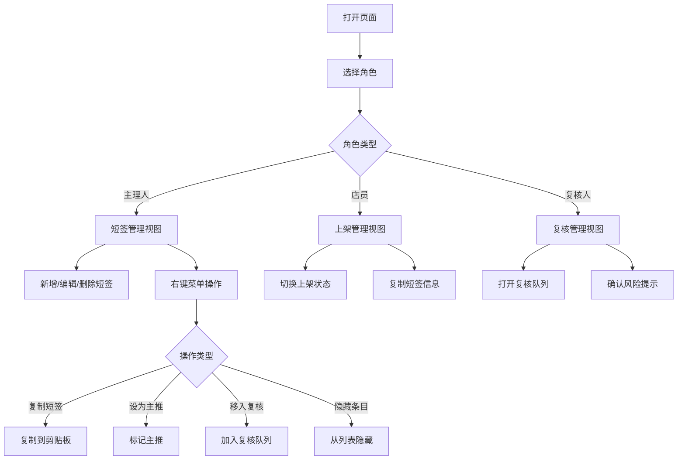

## 1. 产品概述

手作材料短签整理页——面向手作工坊的纯前端材料标签管理工具，支持主理人维护短签、店员标记上架状态、复核人确认风险提示，以键盘快捷键为核心交互方式，辅以右键自定义菜单，实现高效的材料信息整理流程。

- 解决手作工坊材料短签信息分散、状态追踪困难的问题
- 目标用户为小型手作工坊的运营团队，提供零后端依赖的轻量管理方案

## 2. 核心功能

### 2.1 用户角色

| 角色 | 进入方式 | 核心权限 |
|------|----------|----------|
| 主理人 | 页面顶部角色选择器切换 | 新增/编辑/删除短签、设置主推、移入复核、隐藏条目 |
| 店员 | 页面顶部角色选择器切换 | 标记上架/下架状态、复制短签、查看短签详情 |
| 复核人 | 页面顶部角色选择器切换 | 确认风险提示、审阅待复核条目、取消复核标记 |

### 2.2 功能模块

1. **短签列表页**：材料短签卡片展示、角色操作入口、搜索过滤、键盘快捷键操作、右键自定义菜单
2. **新增/编辑弹窗**：短签信息录入与修改表单
3. **复核队列面板**：待复核条目列表与风险确认操作

### 2.3 页面详情

| 页面名称 | 模块名称 | 功能描述 |
|----------|----------|----------|
| 短签列表页 | 角色选择器 | 页面顶部角色切换，不同角色展示不同操作按钮与入口 |
| 短签列表页 | 搜索栏 | 支持按名称/编号/分类模糊搜索，快捷键 Ctrl+K 聚焦 |
| 短签列表页 | 短签卡片网格 | 以卡片形式展示短签信息，包含名称、编号、分类、状态标签、主推标记 |
| 短签列表页 | 状态筛选 | 按上架/下架/待复核/已隐藏筛选 |
| 短签列表页 | 右键菜单 | 自定义右键菜单，提供复制短签、设为主推、移入复核、隐藏条目四项操作 |
| 短签列表页 | 键盘快捷键提示 | 页面底部固定展示当前可用快捷键列表 |
| 新增/编辑弹窗 | 短签表单 | 材料名称、编号、分类、描述、风险提示、价格等字段录入 |
| 复核队列面板 | 待复核列表 | 侧边抽屉展示待复核条目，复核人可逐条确认风险提示 |

## 3. 核心流程

用户打开页面 → 选择角色 → 根据角色权限操作短签列表：
- 主理人可新增短签（Ctrl+N）、编辑删除、设为主推、移入复核、隐藏条目
- 店员可切换上架状态（空格键）、复制短签信息、浏览查看
- 复核人可打开复核队列（Ctrl+R）、确认风险提示、退回修改

右键操作流程：右键点击卡片 → 弹出自定义菜单 → 选择操作 → 执行并刷新列表状态

## 4. 界面设计

### 4.1 设计风格

- **主色调**：暖棕 #8B6F4E 与奶油白 #FDF6EC，体现手作工坊的自然温润感
- **辅助色**：赤陶橘 #C4704B（主推标记）、苔绿 #6B8E6B（上架状态）、烟灰 #9B9B9B（隐藏/下架）
- **按钮风格**：圆角微浮雕风格，hover 时有轻微上浮阴影
- **字体**：标题使用 "Playfair Display" 衬线体体现手作品质感，正文使用 "Noto Sans SC" 确保中文可读性
- **布局风格**：顶部工具栏 + 卡片网格 + 侧边抽屉，桌面优先
- **图标风格**：线性手绘风图标，与手作主题契合
- **背景纹理**：细微纸张肌理纹理覆盖，增强手作质感

### 4.2 页面设计概览

| 页面名称 | 模块名称 | UI 元素 |
|----------|----------|---------|
| 短签列表页 | 角色选择器 | 顶部居中，三个角色标签按钮，选中态有下划线与背景色变化 |
| 短签列表页 | 搜索栏 | 顶部工具栏区域，输入框带搜索图标，Ctrl+K 快捷键提示 |
| 短签列表页 | 短签卡片 | 圆角卡片，左上角编号标签，右上角状态徽章，中部名称与分类，底部价格与操作区 |
| 短签列表页 | 右键菜单 | 浮动菜单，四项操作图标+文字，hover 背景色变化 |
| 短签列表页 | 快捷键提示栏 | 底部固定半透明条，列出当前角色可用快捷键 |
| 新增/编辑弹窗 | 表单弹窗 | 居中模态框，表单字段分组排列，底部确认/取消按钮 |
| 复核队列面板 | 侧边抽屉 | 右侧滑出，条目列表带风险提示标签，操作按钮 |

### 4.3 响应式

- 桌面优先设计，1920px/1440px/1024px 三个断点
- 卡片网格自适应列数：大屏 4 列 → 中屏 3 列 → 小屏 2 列
- 右键菜单在触屏设备降级为长按触发

### 4.4 键盘快捷键定义

| 快捷键 | 功能 | 适用角色 |
|--------|------|----------|
| Ctrl+N | 新增短签 | 主理人 |
| Ctrl+K | 聚焦搜索 | 全部角色 |
| 空格键 | 切换选中卡片上架状态 | 店员 |
| Ctrl+R | 打开复核队列 | 复核人 |
| 右键 / Ctrl+M | 打开右键菜单 | 全部角色（菜单项按角色过滤） |
| Escape | 关闭弹窗/菜单 | 全部角色 |
| ↑↓ | 上下选择卡片 | 全部角色 |
| Enter | 确认操作 | 全部角色 |
