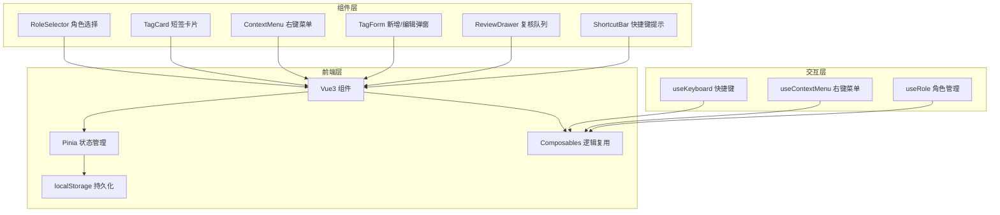
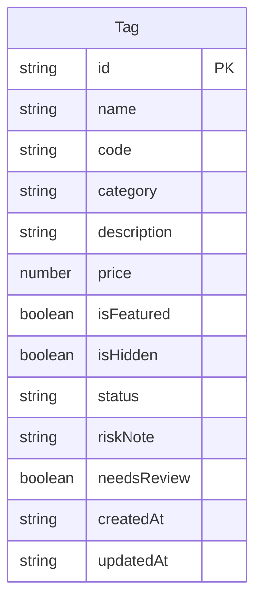

## 1. 架构设计



纯前端架构，无后端服务，数据存储于 localStorage。

## 2. 技术说明

- **前端框架**：Vue3@3 + TypeScript@5 + Vite@6
- **UI 组件库**：Element Plus@2
- **状态管理**：Pinia@2（含 localStorage 持久化插件）
- **样式方案**：SCSS + CSS Variables（主题色系统）
- **构建工具**：Vite@6
- **后端**：无
- **数据存储**：localStorage（前端持久化）

## 3. 路由定义

| 路由 | 用途 |
|------|------|
| / | 短签列表主页（含角色选择、搜索、卡片网格、右键菜单） |

单页应用，无需多路由，通过组件状态切换展示不同视图。

## 4. 数据模型

### 4.1 数据模型定义



### 4.2 数据类型定义

```typescript
type Role = 'manager' | 'assistant' | 'reviewer'

type TagStatus = 'on_shelf' | 'off_shelf' | 'under_review' | 'hidden'

interface MaterialTag {
  id: string
  name: string
  code: string
  category: string
  description: string
  price: number
  isFeatured: boolean
  isHidden: boolean
  status: TagStatus
  riskNote: string
  needsReview: boolean
  createdAt: string
  updatedAt: string
}
```

## 5. 组件结构

```
src/
├── App.vue
├── main.ts
├── types/
│   └── index.ts
├── stores/
│   ├── tagStore.ts
│   └── roleStore.ts
├── composables/
│   ├── useKeyboard.ts
│   ├── useContextMenu.ts
│   └── useClipboard.ts
├── components/
│   ├── RoleSelector.vue
│   ├── SearchBar.vue
│   ├── TagCard.vue
│   ├── TagGrid.vue
│   ├── ContextMenu.vue
│   ├── TagFormDialog.vue
│   ├── ReviewDrawer.vue
│   └── ShortcutBar.vue
├── styles/
│   ├── variables.scss
│   └── global.scss
└── data/
    └── mockTags.ts
```
